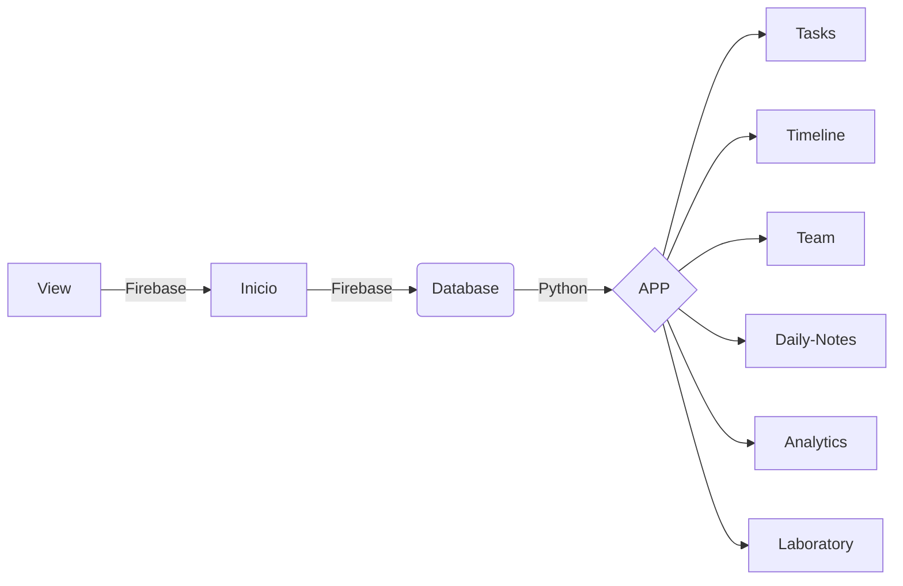

### FLUXOGRAMA/DIAGRAMA
```
flowchart LR
A[Inicio] -->|Firebase| B(Database)
B --> |Python| C{APP}

C --> J[Tasks]
C --> K[Timeline]
C --> L[Team]
C --> M[Daily-Notes]
C --> N[Analytics]
C --> O[Laboratory]

```



### 1.0 - FASES DO PROJETO

<ul>
  
  <li>
    <p><b><code>1.1 - [VIRTUAL ENV] </code></b></p>
    <p><i> Instrução:  </i></p>
  </li>
  
  <li>
    <p><b><code>1.2 - [FRONT-END] </code></b></p>
    <p><i> Lo:   </i></p>
  </li> 
  
  <li>
    <p><b><code>1.3 - [BACK-END] </code></b></p>
    <p><i> Login: https://www.youtube.com/watch?v=ddjT_Gdp_cc  </i></p>
  </li>
  
</ul>

